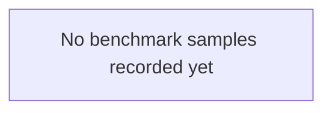

# FloatChat architecture

This diagram is generated by `backend/scripts/generate_architecture.py` from
durable `benchmark_runs` samples. Values are measured wall-clock percentiles,
not estimates.

Samples: 0. Total latency: p50 0.0 ms, p95 0.0 ms.

The live `/metrics` endpoint exposes the same layer percentiles and recent runs.
